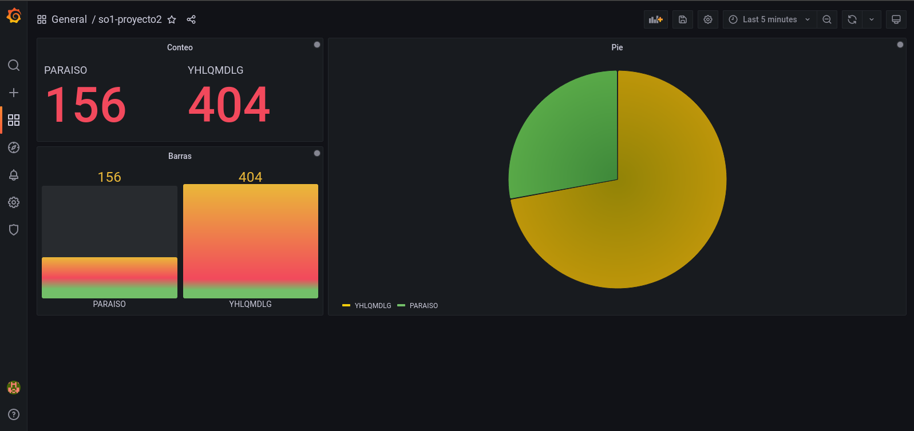

# PROYECTO 2

## Introducción

En este proyecto, se tiene como objetivo principal implementar un sistema de votaciones para un concurso de bandas de música guatemalteca; el propósito de este es enviar tráfico por medio de archivos con votaciones creadas hacia distintos servicios (grpc y rust) que van a encolar cada uno de los datos enviados, así mismo se tendrán ciertos consumidores a la escucha del sistema de colas para enviar datos a una base de datos en Redis; estos datos se verán en dashboards en tiempo real. También se tiene una base de datos de Mongodb para guardar los logs, los cuales serán consultados por medio de una aplicación web.

## Objetivos

- Implementar un sistema de votaciones para un concurso de bandas de música guatemalteca.
- Enviar tráfico por medio de archivos con votaciones creadas hacia distintos servicios (grpc y rust) que van a encolar cada uno de los datos enviados.
- Tener ciertos consumidores a la escucha del sistema de colas para enviar datos a una base de datos en Redis.
- Ver los datos en dashboards en tiempo real.
- Tener una base de datos de Mongodb para guardar los logs, los cuales serán consultados por medio de una aplicación web.

## Tecnologías

### kubernetes

Es un sistema de código abierto para la automatización del despliegue, escalado y manejo de aplicaciones en contenedores. Se utiliza para orquestar contenedores de Docker y proporcionar una plataforma de administración de contenedores. Kubernetes se basa en más de una década de experiencia de Google en la ejecución de cargas de trabajo en producción a escala, combinada con las mejores ideas y prácticas de la comunidad.

### gcloud

Es una plataforma de computación en la nube que se ejecuta en la infraestructura de Google. Ofrece una amplia gama de servicios, incluidos servicios de computación, almacenamiento, bases de datos, análisis, inteligencia artificial y aprendizaje automático.

#### instalación

```bash
curl -O https://dl.google.com/dl/cloudsdk/channels/rapid/downloads/google-cloud-cli-472.0.0-linux-x86_64.tar.gz
tar -xf google-cloud-cli-472.0.0-linux-x86_64.tar.gz
./google-cloud-sdk/install.sh
gcloud init
```

### kubectl

Es una herramienta de línea de comandos que se utiliza para interactuar con clústeres de Kubernetes. Se utiliza para desplegar aplicaciones, inspeccionar y gestionar clústeres de Kubernetes.

#### instalación

```bash
gcloud components install kubectl
kubectl version
```

### helm

Es un administrador de paquetes de Kubernetes que permite a los usuarios encontrar, compartir e implementar aplicaciones en Kubernetes. Se utiliza para simplificar la implementación y la gestión de aplicaciones en Kubernetes.

#### instalación

```bash
curl -fsSL -o get_helm.sh https://raw.githubusercontent.com/helm/helm/master/scripts/get-helm-3
chmod 700 get_helm.sh
./get_helm.sh
```

### locust

Es una herramienta de prueba de carga de código abierto que se utiliza para evaluar el rendimiento de las aplicaciones web y los servicios web. Se utiliza para simular el comportamiento de los usuarios y medir el rendimiento de las aplicaciones en condiciones de carga.

### grpc

Es un framework de comunicación de procedimientos remotos de código abierto desarrollado por Google. Se basa en el protocolo de comunicación HTTP/2 para el transporte de mensajes y utiliza Protocol Buffers como interfaz de descripción de la aplicación.

#### yaml

```yaml
apiVersion: apps/v1
kind: Deployment
metadata:
  name: grpc-deployment
  namespace: so1-proyecto2
spec:
  selector:
    matchLabels:
      app: grpc
  replicas: 1
  template:
    metadata:
      labels:
        app: grpc
    spec:
      containers:
        - name: grpc-client
          image: keviingarciah/so1_grpc_client:v1.3
          ports:
            - containerPort: 3000
          resources:
            limits:
              cpu: "0.2"
              memory: "500Mi"
        - name: grpc-server
          image: keviingarciah/so1_grpc_server:v1.3
          ports:
            - containerPort: 3001
          resources:
            limits:
              cpu: "0.2"
              memory: "500Mi"
---
apiVersion: v1
kind: Service
metadata:
  name: grpc-service
  namespace: so1-proyecto2
spec:
  type: LoadBalancer
  ports:
    - name: grpc-client-port
      port: 3000
      targetPort: 3000
      protocol: TCP
  selector:
    app: grpc
```

### rust

Es un lenguaje de programación de sistemas que se centra en la seguridad, la velocidad y la concurrencia. Su sintaxis es similar a la de C++, pero su sistema de tipos es más seguro y su rendimiento es mejor.

#### yaml

```yaml
apiVersion: apps/v1
kind: Deployment
metadata:
  name: rust-deployment
  namespace: so1-proyecto2
spec:
  selector:
    matchLabels:
      app: rust
  replicas: 1
  template:
    metadata:
      labels:
        app: rust
    spec:
      containers:
        - name: rust-client
          image: keviingarciah/so1_rust_client:v1.0
          ports:
            - containerPort: 8000
          resources:
            limits:
              cpu: "0.2"
              memory: "500Mi"
        - name: rust-server
          image: keviingarciah/so1_rust_server:v1.0
          ports:
            - containerPort: 8080
          resources:
            limits:
              cpu: "0.2"
              memory: "500Mi"
---
apiVersion: v1
kind: Service
metadata:
  name: rust-service
  namespace: so1-proyecto2
spec:
  type: LoadBalancer
  ports:
    - name: rust-client-port
      port: 8000
      targetPort: 8000
      protocol: TCP
  selector:
    app: rust
```

### kafka

Es una plataforma de transmisión de datos distribuida que se utiliza para la creación de aplicaciones de transmisión de datos y procesamiento de eventos en tiempo real. Está diseñado para ser tolerante a fallos y escalable horizontalmente. Kafka permite a los usuarios publicar y suscribirse a flujos de datos, almacenar flujos de datos en clústeres y procesar flujos de datos a medida que se producen.

#### configuración

```bash
kubectl create -f 'https://strimzi.io/install/latest?namespace=<namespace>' -n <namespace>
kubectl apply -f https://strimzi.io/examples/latest/kafka/kafka-persistent-single.yaml -n <namespace>
```

### consumer

Es un deployemnt de un pod con un servicio escrito en golang que consume los eventos de kafka y los guarda en la base de datos de mongo y redis.

#### yaml

```yaml
apiVersion: apps/v1
kind: Deployment
metadata:
  name: consumer-deployment
  namespace: so1-proyecto2
spec:
  replicas: 2
  selector:
    matchLabels:
      app: consumer
  template:
    metadata:
      labels:
        app: consumer
    spec:
      containers:
        - name: consumer
          image: keviingarciah/so1_consumer:v1.5
          resources:
            requests:
              memory: "500Mi"
              cpu: "0.2"
            limits:
              memory: "500Mi"
              cpu: "0.2"
```

### redis

Es una base de datos en memoria de código abierto que se utiliza como base de datos, caché y agente de mensajes. Admite estructuras de datos como cadenas, hashes, listas, conjuntos, conjuntos ordenados con consultas de rango, mapas de bits, hiperloglogs, índices geoespaciales y flujo de datos de transmisión.

#### yaml

```yaml
apiVersion: apps/v1
kind: Deployment
metadata:
  name: redis-deployment
  namespace: so1-proyecto2
  labels:
    app: redis
spec:
  replicas: 1
  selector:
    matchLabels:
      app: redis
  template:
    metadata:
      labels:
        app: redis
    spec:
      containers:
        - name: redis
          image: redis
          ports:
            - containerPort: 6379
          resources:
            requests:
              memory: "250Mi"
              cpu: "0.1"
            limits:
              memory: "500Mi"
              cpu: "0.2"
---
apiVersion: v1
kind: Service
metadata:
  name: redis-service
  namespace: so1-proyecto2
spec:
  type: LoadBalancer
  ports:
    - port: 6379
      targetPort: 6379
  selector:
    app: redis
```

### mongodb

Es una base de datos de documentos distribuida de código abierto que proporciona un alto rendimiento, alta disponibilidad y escalabilidad automática. MongoDB funciona en concepto de colecciones y documentos.

#### yaml

```yaml
apiVersion: apps/v1
kind: Deployment
metadata:
  name: mongodb-deployment
  namespace: so1-proyecto2
  labels:
    app: mongodb
spec:
  replicas: 1
  selector:
    matchLabels:
      app: mongodb
  template:
    metadata:
      labels:
        app: mongodb
    spec:
      containers:
        - name: mongodb
          image: mongo
          ports:
            - containerPort: 27017
          resources:
            requests:
              memory: "250Mi"
              cpu: "0.1"
            limits:
              memory: "500Mi"
              cpu: "0.2"
---
apiVersion: v1
kind: Service
metadata:
  name: mongodb-service
  namespace: so1-proyecto2
spec:
  type: LoadBalancer
  ports:
    - port: 27017
      targetPort: 27017
  selector:
    app: mongodb
```

### grafana

Es una plataforma de análisis y visualización de código abierto que permite a los equipos de operaciones comprender la métrica de su sistema. Grafana permite a los usuarios crear, explorar y compartir paneles interactivos y visualizaciones de datos en tiempo real. También se puede integrar con una amplia variedad de fuentes de datos, como Prometheus, InfluxDB, Elasticsearch, AWS CloudWatch, MySQL, PostgreSQL y Graphite.

#### yaml

```yaml
apiVersion: v1
kind: ConfigMap
metadata:
  name: grafana-datasources
  namespace: so1-proyecto2
data:
  prometheus.yaml: |-
    {
        "apiVersion": 1,
        "datasources": [
            {
               "access":"proxy",
                "editable": true,
                "name": "redis",
                "orgId": 1,
                "password":"YOUR_PASSWORD",
                "type": "redis",
                "url": "redis://redis.monitoring.svc:6379",
                "version": 1
            }
        ]
    }
---
apiVersion: apps/v1
kind: Deployment
metadata:
  name: grafana
  namespace: so1-proyecto2
spec:
  replicas: 1
  selector:
    matchLabels:
      app: grafana
  template:
    metadata:
      name: grafana
      labels:
        app: grafana
    spec:
      containers:
        - name: grafana
          image: grafana/grafana:8.4.4
          ports:
            - name: grafana
              containerPort: 3000
          resources:
            #          limits:
            #            memory: "1Gi"
            #            cpu: "1000m"
            requests:
              memory: 200M
              cpu: "200m"
          volumeMounts:
            - mountPath: /var/lib/grafana
              name: grafana-storage
            - mountPath: /etc/grafana/provisioning/datasources
              name: grafana-datasources
              readOnly: false
      volumes:
        - name: grafana-storage
          emptyDir: {}
        - name: grafana-datasources
          configMap:
            defaultMode: 420
            name: grafana-datasources
---
apiVersion: v1
kind: Service
metadata:
  creationTimestamp: null
  labels:
    app: grafana
  name: grafana
  namespace: so1-proyecto2
spec:
  ports:
    - port: 3000
      protocol: TCP
      targetPort: 3000
  selector:
    app: grafana
  type: LoadBalancer
```

### ingress

Es un controlador de Kubernetes que implementa el equilibrio de carga y la terminación SSL para las aplicaciones de Kubernetes. Se puede configurar para exponer servicios HTTP y HTTPS desde el clúster de Kubernetes a través de un controlador de ingreso que se ejecuta en el clúster. Este se utiliza para exponer los servicios de la aplicación a través de un dominio personalizado.

#### configuración

```bash
kubectl create ns nginx-ingress
helm repo add ingress-nginx https://kubernetes.github.io/ingress-nginx
helm repo update
helm install nginx-ingress ingress-nginx/ingress-nginx -n nginx-ingress
```

#### yaml

```yaml
apiVersion: networking.k8s.io/v1
kind: Ingress
metadata:
  name: cluster-ingress
  namespace: so1-proyecto2
spec:
  ingressClassName: nginx
  rules:
    - host: 34.72.55.202.nip.io
      http:
        paths:
          - path: /grpc
            pathType: Prefix
            backend:
              service:
                name: grpc-service
                port:
                  number: 3000
          - path: /rust
            pathType: Prefix
            backend:
              service:
                name: rust-service
                port:
                  number: 8000
```

### hpa

Es un controlador de Kubernetes que escala automáticamente el número de pods en un deployment, replicaset o statefulset basado en las métricas de CPU o memoria. Se utiliza para escalar los pods de los servicios de acuerdo a la demanda de los usuarios.

#### yaml

```yaml
apiVersion: autoscaling/v1
kind: HorizontalPodAutoscaler
metadata:
  name: hpa
  namespace: so1-proyecto2
spec:
  scaleTargetRef:
    apiVersion: apps/v1
    kind: Deployment
    name: consumer-deployment
  minReplicas: 2
  maxReplicas: 5
  targetCPUUtilizationPercentage: 40
```

## Funcionamiento

Primero debemos inicializar locust para enviar tráfico a los servicios de grpc y rust. Ponemos la dirección del ingress y el puerto del servicio que queremos enviar tráfico.


Le damos a **START** y vereos como se envía tráfico a los servicios.


Luego, veremos como los servicios de grpc y rust reciben los datos y los encolan en kafka. Para luego estos ser consumidos por el servicio de consumer y ser guardados en la base de datos de redis, para luego ser visualizados en un dashboard en grafana.



También veremos como los logs son guardados en la base de datos de mongodb.


## Conclusiones

- Se logró implementar un sistema de votaciones para un concurso de bandas de música guatemalteca.
- Se logró enviar tráfico por medio de archivos con votaciones creadas hacia distintos servicios (grpc y rust) que van a encolar cada uno de los datos enviados.
- Se logró tener ciertos consumidores a la escucha del sistema de colas para enviar datos a una base de datos en Redis.
- Se logró ver los datos en dashboards en tiempo real.
- Se logró tener una base de datos de Mongodb para guardar los logs, los cuales serán consultados por medio de una aplicación web.
