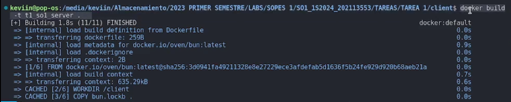
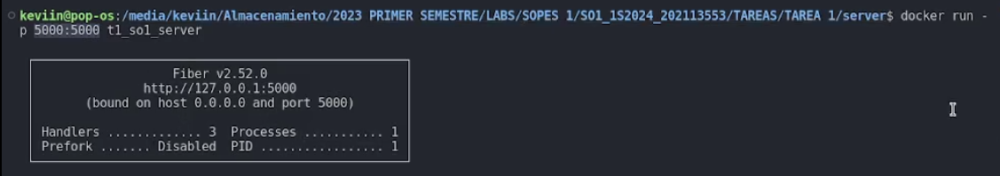
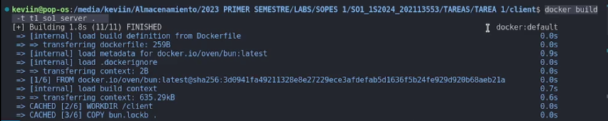
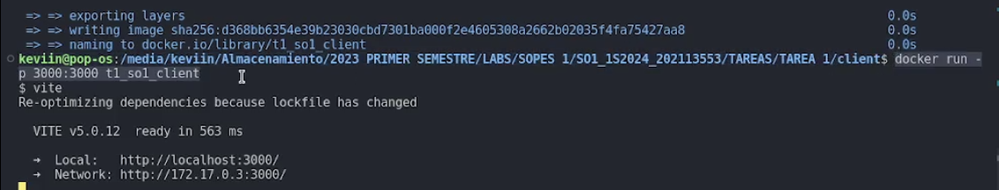
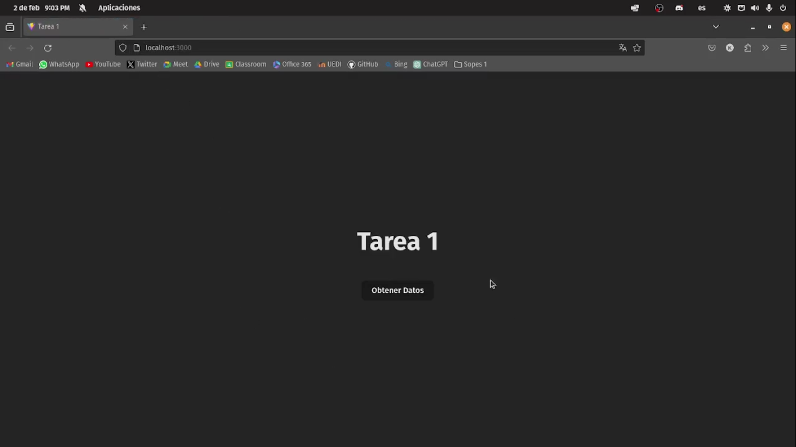
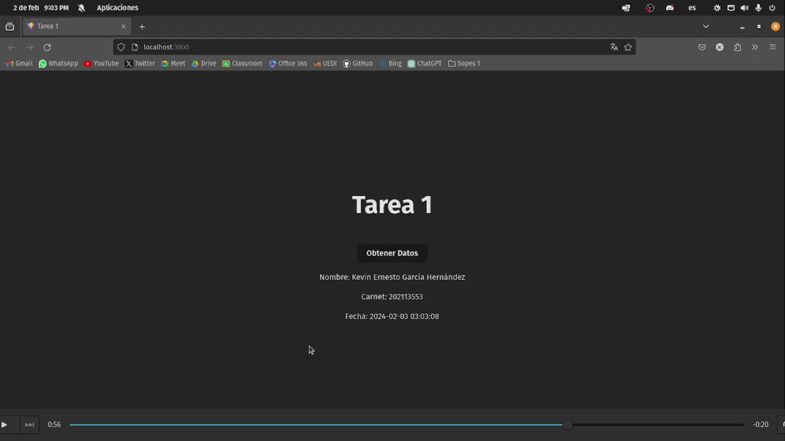
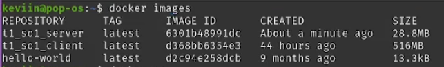
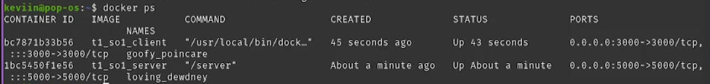

# Tarea 1

Este documento proporciona instrucciones detalladas sobre cómo crear y levantar imágenes para un frontend en React y un backend en Go utilizando contenedores Docker.

## Backend

### **Comandos de Docker para el Backend:**

```bash
# Desde el directorio del backend, construir la imagen Docker
docker build -t t1_so1_server .

# Levantar el contenedor Docker del backend
docker run -p 5000:5000 t1_so1_server
```

## Frontend

### **Comandos de Docker para el Frontend:**

```bash
# Desde el directorio del frontend, construir la imagen Docker
docker build -t t1_so1_client .

# Levantar el contenedor Docker del frontend
docker run -p 3000:3000 t1_so1_client
```

## ¡Listo!

Con estos pasos, se han creado y levantado contenedores Docker para el backend y frontend. Se puede acceder al backend en `http://localhost:5000` y al frontend en `http://localhost:3000`.

## Video

https://youtu.be/GOdWpF5mdTA

## Screenshoots









